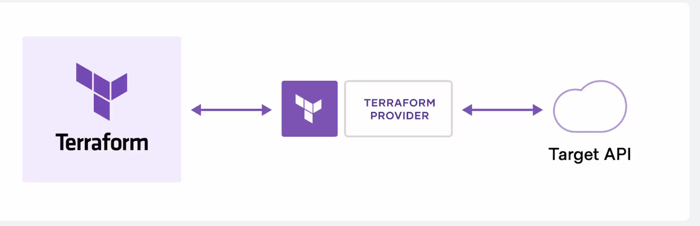
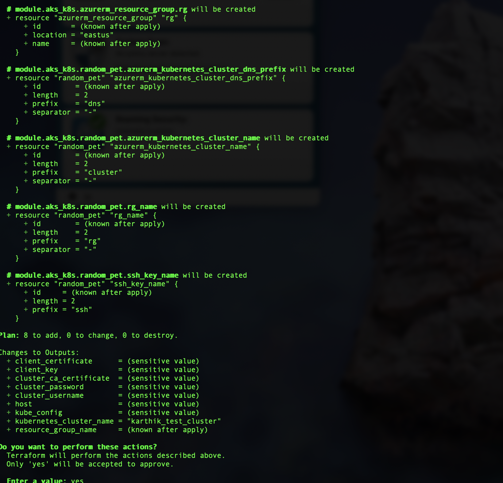
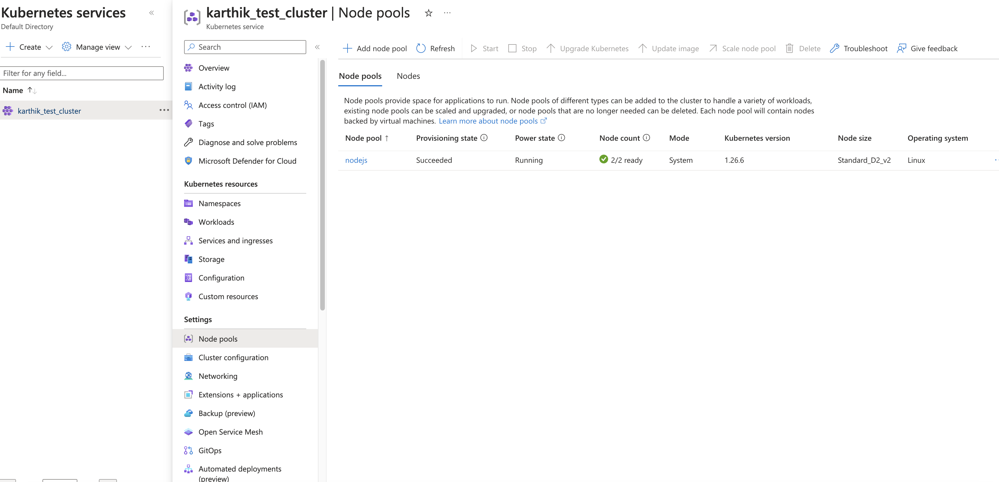
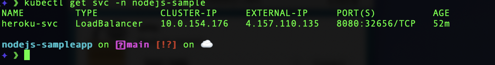
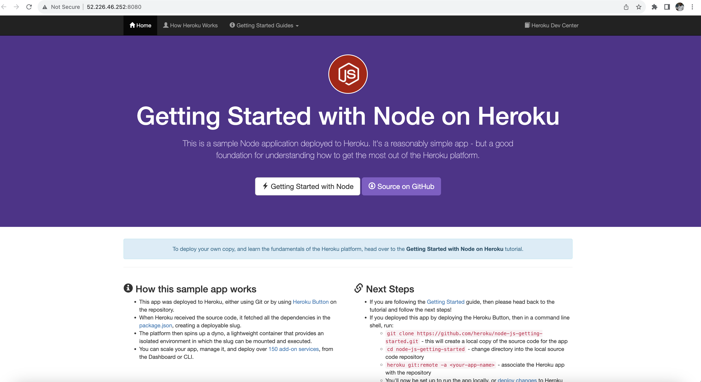
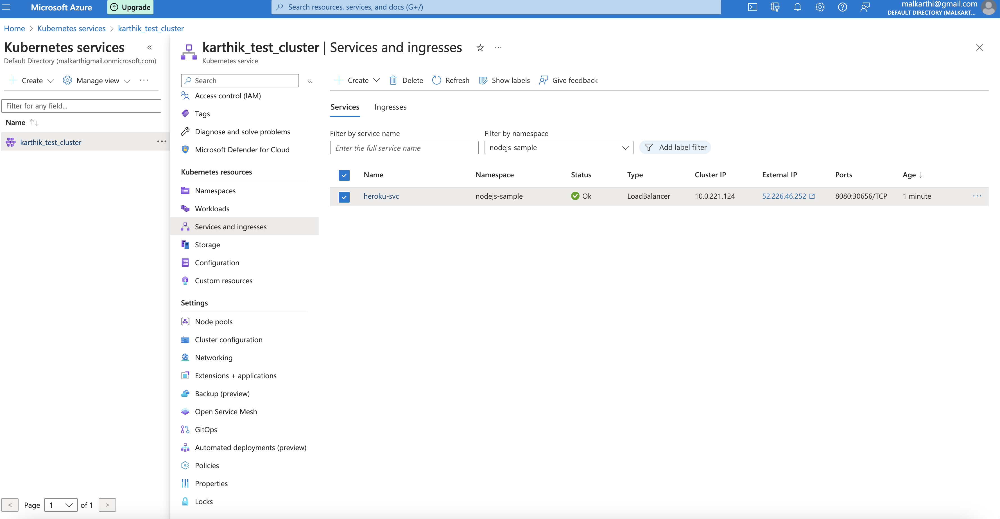

## Deploy kubernetes applications using Iac (terraform) and kubernetes automation tool(kustomize)
### The below tools has been used for deploying the application
    - Terraform cli
    - kustomize
    - Azure cli
    - kubernetes
    - Azure console
## How to deploy Azure cluster using Terraform
### What is terraform:
- Terraform is infrastructure as code tool using that we can automate deployement of any infrastructure. Terraform supports on-prem and anu cloud infrastructure.
- Terraform creates and manages resources on cloud platforms and other services through their application programming interfaces (APIs). Providers enable Terraform to work with virtually any platform or service with an accessible API.
- Terraform is an infrastructure as code tool that lets you define both cloud and on-prem resources in human-readable configuration files that you can version, reuse, and share. 
- You can then use a consistent workflow to provision and manage all of your infrastructure throughout its lifecycle. Terraform can manage low-level components like compute, storage, and networking resources, as well as high-level components like DNS entries and SaaS features.
- Terraform community have already written thousands of providers to manage many different types of resources and services. You can find all publicly available providers on the Terraform Registry, including Amazon Web Services (AWS), Azure, Google Cloud Platform (GCP), Kubernetes, Helm, GitHub, Splunk, DataDog, and many more.
- Terraform architecture 
- The Core Terraform consists of three stages
    - Write: You define resources, which may be across multiple cloud providers and services. For example, you might create a configuration to deploy an application on virtual machines in a Virtual Private Cloud (VPC) network with security groups and a load balancer.
    - Plan: Terraform creates an execution plan describing the infrastructure it will create, update, or destroy based on the existing infrastructure and your configuration.
    - Apply: On approval, Terraform performs the proposed operations in the correct order, respecting any resource dependencies. For example, if you update the properties of a VPC and change the number of virtual machines in that VPC, Terraform will recreate the VPC before scaling the virtual machines.

### Deploy AKS cluster using Terraform
- I have used below providers for deploying Kubernetes cluster in Azure
    - azapi (The AzAPI provider enables you to manage any Azure resource type using any API version. This provider complements the AzureRM provider by enabling the management of new Azure resources and properties)
    ```bash
     azapi = {
      source  = "azure/azapi"
      version = "~>1.5"
    }
    ```
    - azurerm (The AzureRM Terraform Provider allows managing resources within Azure Resource Manager.)
    ```bash
    azurerm = {
      source  = "hashicorp/azurerm"
      version = "~>3.0"
    }
    ```
    - random(The "random" provider allows the use of randomness within Terraform configurations. This is a logical provider, which means that it works entirely within Terraform's logic, and doesn't interact with any other services.)
    ```bash
    random = {
      source  = "hashicorp/random"
      version = "~>3.0"
    ```
    - time (The time provider is used to interact with time-based resources. The provider itself has no configuration options. Use the navigation to the left to read about the available resources.)
    ```bash
     time = {
      source  = "hashicorp/time"
      version = "0.9.1"
    }
    ```
- Various way we can authenticate to Azure portal for applying terraform
    - Azure cli
    - Service principal (Recommended way to authetication). 2 way we can use service principle for the authentication
        - Environment vairable
            ```bash
            export ARM_SUBSCRIPTION_ID="<azure_subscription_id>"
            export ARM_TENANT_ID="<azure_subscription_tenant_id>"
            export ARM_CLIENT_ID="<service_principal_appid>"
            export ARM_CLIENT_SECRET="<service_principal_password>"
            ```
        - Provide value in terraform provide block
          ```bash
          provider "azurerm" {
             features {}
            subscription_id   = "<azure_subscription_id>"
            tenant_id         = "<azure_subscription_tenant_id>"
            client_id         = "<service_principal_appid>"
            client_secret     = "<service_principal_password>"
         }
         ```
    - The recommendation will be store these values in vault and retrive during the pipeline execution. we can use azure plugin to retrive the secret and set as environment variable in the desktop.

- I have used both method for authentication for applying the terraform.
- I have stored my terraform code in [aks_deployment](https://github.com/BoseKarthikeyan/aks_k8s_tfm)
- I have created the module for reusability, root moule codes are in main folder and submodules codes are in under example folder.
- Terraform apply evidence 
- Terraform apply completed successfully 
- From Azure console 
- I have used Autoscaler configuration. The minimum node set to 2 and maximum set to 4.

## Deploy nodejs-sampleapp in kubernetes

### Kubernetes
Kubernetes is an open-source container orchestration platform that automates the deployment, scaling, and management of containerized applications. It groups containers into logical units for easy management and discovery, and includes built-in commands for deploying applications, rolling out changes to applications, scaling applications up and down to fit changing needs, monitoring applications, and more.1 Kubernetes has a large, rapidly growing ecosystem, and its services, support, and tools are widely available.2 It was originally designed by Google and is now maintained by the Cloud Native Computing Foundation.4 Kubernetes has become a key part of the container revolution, making containerized applications dramatically easier to manage at scale.

### Application manifest used for deploying the application
- Have stored application manifest in [kubernetes_manifest](https://github.com/BoseKarthikeyan/nodejs-sampleapp)
    - ns.yaml for creating namespace
    - Deployment.yaml for deploying the applications.I have used to topology spread constriant to control how the pod distrubuted across the node,zone and nodes.
    - ns-quota.yaml for creating resource quota for namespaces
        - have set CPU limit as 8vCPU, memory limit as 16Gi, storage at 50GB and service port count as 5.
    - hpa (Horizontal POD autoscaler) for autoscaling
        - If the memory utilization goes 70% it will spinup another container
        - If the CPU utilization goes 80% it will spinup the another container.
        - The minimum replica count is 2 and maximum is 10.
    - PDB (POD distrubtion budget) to make sure always minimum container running at given any situation.
        - PDB make sure one pod always available in given any situation.
        - since am using trial namespace am keeping only one pod at same time.
    - Kubernetes service
        - Am using type as loadbalance, so that i can get the external ip and users are able to access the application extenally.
        - Exterl ipaddress is 4.157.110.135 . Please note that this ipaddress will get changed. since am using free trial i will shutdown the cluster.
## Applciation URL evidence
- Able to access the application externally

- Application service ipaddress from Azure portal


## Container image
- As a best practise container image should be always small. Have followed the below best practises
- Have used Redhat ubi image as base image for building the container.
- I have cloned the bitbucket repo to the container.
- Installating require package in the container such as nodejs, heroku cli, npm, shadowtil, gitcore etc..
- creating user with 1001 uid.
- Making sure all the unwanted files are deleted end of the build, otherwise the size of container will be too big.
- Doker file location [Dockerfile](https://github.com/BoseKarthikeyan/nodejs-sampleapp/blob/main/Dockerfile)
- Docker image location [Image](https://quay.io/sample-nodejs/heroku-sample:v1)
- Using kustomization to apply the manifest files in the cluster.

```bash
✦ ❯ kustomize build . | kubectl apply -f -
namespace/nodejs-sample created
resourcequota/nodejs-sample-quota created
service/heroku-svc created
deployment.apps/heroku-sample created
poddisruptionbudget.policy/sample-pdb created
horizontalpodautoscaler.autoscaling/sample-hpa created
```
- Kusotmization yaml file example
```bash
apiVersion: kustomize.config.k8s.io/v1beta1
kind: Kustomization
resources:
  - ./ns.yaml
  - ./deployment.yaml
  - ./hpa.yaml
  - ./pdb.yaml
  - ./svc.yaml
  - ./route.yaml
  - ./ns-quota.yaml
```
### Automation recommendation for terraform
- We should have any ci/cd tools (Jenkins, Tekton etc..) for terraform 
- it should get secrets from vault or other secret tools
- During the code pull it should validate using terraform plan command
- Once validation is done it should send the status back to Github or Bitbucket
- Upon push or merge the code to master branch, pipeline shoule trigger
- Apply the terraform changes
- Should have linting and functional testing tasks to validate the changes.

### Automation recommendation for Kubernetes object
- We should have tools like Argocd or kustomize
- It should watch github or butbucket always and if any changes it can push the changes automatically in dev environment
- For production environment it should be manual push.

### Pleae note that since am using free trail am unable to create DNS zone also the ipaddress of application get change when destroy and create again.
